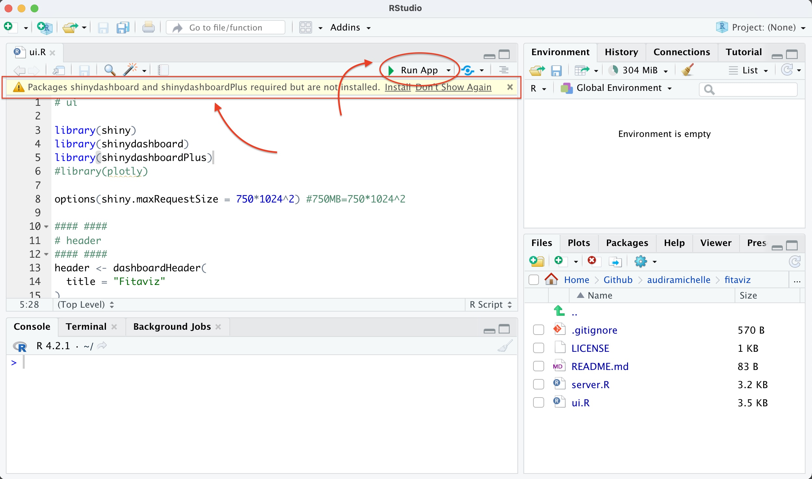
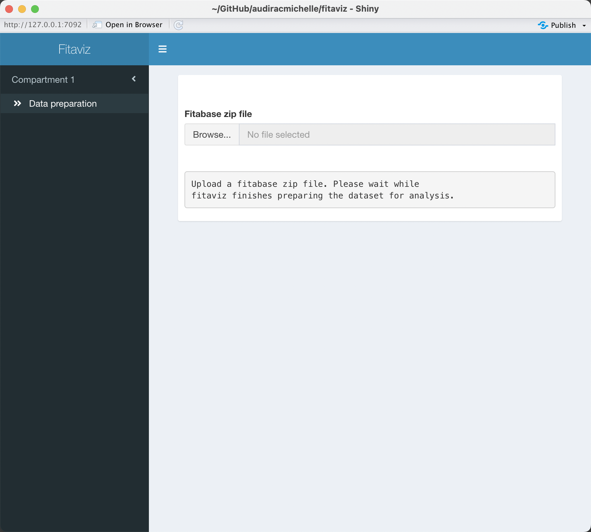

# fitaviz

Fitbit data manipulation tool for epidemiological and clinical studies.

## How to

* Clone this repository. 

* Open Rsudio and install `fitibble` package with

```
devtools::install_github("audiracmichelle/fitibble")
```

* In RStudio open `ui.R`.



* If you haven't done it yet, install the required packages. In most cases a yellow message box will appear at the top of RStudio's source pane indicating the packages that are missing.

* Click the Run App button at the top right of the source pane. The `fitaviz` home window will pop .


